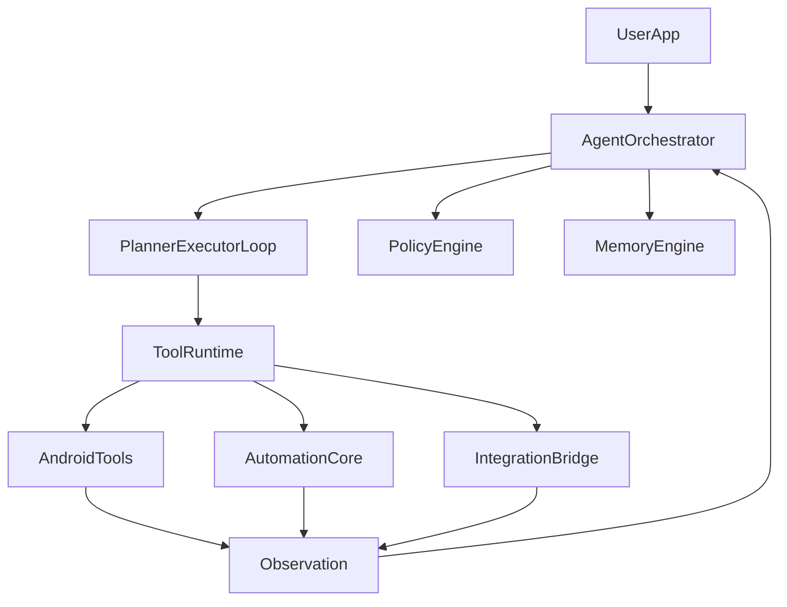

# Android miclaw MVP

`android-agent` 是一个面向 Android 手机智能控制的 MVP 骨架项目。

它不尝试复刻 OEM 级 `miclaw`，而是把 `openclaw` 里成熟的几层思想拆出来重组：

- 控制平面与任务编排
- 工具注册与统一调用
- Android 本地感知与执行
- 风险分级与确认流
- Cursor 多 agent 协作开发

## 当前范围

本仓库当前实现的是“可继续开发的项目骨架”，重点在于：

- 冻结 MVP 场景、风险边界与工具协议
- 建立 Android App + 编排模块 + 策略模块 + 共享模型模块
- 提供最小可运行的 Planner/Executor 循环骨架
- 引入 recipe-first 与 approval-first 的扩展位
- 为通知、日历、联系人、短信、UI 自动化预留标准接口

## 目录

```text
android-agent/
├── apps/android-app/         # Android 宿主应用
├── modules/                  # 编排、策略、工具、记忆、审批、recipe、桥接等模块
├── docs/                     # MVP 文档与协作规范
├── settings.gradle.kts
├── build.gradle.kts
└── gradle.properties
```

## MVP 场景

- 通知理解与动作执行
- 日程助理
- 通讯助理
- UI 自动化 MVP

详细定义见 `docs/demo-scenarios.md`。

## 架构摘要



## Cursor 多 agent 开发原则

- 一个 agent 只负责一个模块或一类职责。
- `docs/tool-contract.md` 是工具接口事实来源。
- 涉及跨模块变更时，先更新契约，再让实现 agent 继续编码。
- 每天结束前由 review agent 做接口一致性与风险回归检查。

详细流程见 `docs/multi-agent-workflow.md`。
