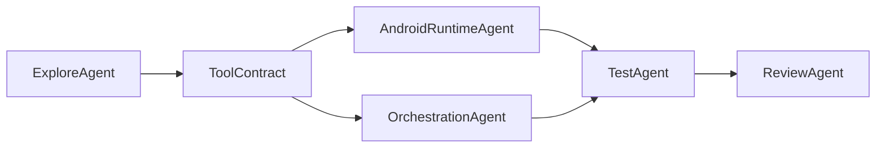

# Cursor Multi-Agent Workflow

## 目标

本项目默认使用 Cursor 多 agent 协作，但必须限制每个 agent 的职责边界，防止协议漂移和重复造轮子。

## 固定角色

### AndroidRuntimeAgent

负责：

- Android App 宿主层
- `ForegroundService`
- `NotificationListenerService`
- `AccessibilityService`
- Android tool handlers
- 权限申请与前后台约束

禁止：

- 改 `docs/tool-contract.md`
- 改 Planner/Executor 主流程

### OrchestrationAgent

负责：

- 任务状态机
- Planner/Executor/Observe/Replan 循环
- 审批流
- 任务日志
- 工具分发和执行结果聚合

禁止：

- 直接写 Android 平台 API 细节
- 私自定义未登记的新工具字段

### TestAgent

负责：

- 工具 mock
- 编排层单测
- 风险流与幂等测试
- 集成联调检查项

### ReviewAgent

负责：

- 接口一致性审查
- 权限和风险策略审查
- 误触发和回退路径检查

## 工作流

## 协作规则

1. 所有 agent 开工前先读 `docs/tool-contract.md`。
2. 新能力先补文档，再补实现。
3. 跨模块变更必须先冻结 DTO。
4. `ReviewAgent` 在每天收尾时检查：
   - 工具入参与返回是否一致
   - 是否出现绕过审批的高风险路径
   - 是否出现 handler 直接串调别的 handler

## 推荐任务拆分

### 并行任务 A

- 搭 Android app
- 补权限和系统服务
- 完成通知/日历/联系人/短信 handler

### 并行任务 B

- 完成 shared models
- 完成 tool runtime
- 完成 risk policy
- 完成 planner/executor loop

### 串行联调任务

- 将 handler 接到 tool dispatcher
- 跑场景 1 与场景 3
- 再补 `ui.inspect` 和 `ui.act`

## 禁止事项

- 多个 agent 同时改同一个协议文件
- 没有审计日志的写操作直接合并
- 没有 mock 测试的风险流直接上线
