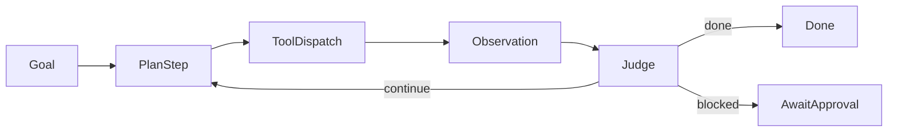

# Orchestration Loop

## 目标

实现一个最小可用的 `Plan -> Execute -> Observe -> Replan` 循环，而不是一开始做高度自治的多智能体系统。

## 状态流

## 核心对象

- `TaskContext`: 任务上下文与最近观测
- `PlanningModel`: 决定下一步的 planner 接口
- `ToolDispatcher`: 执行工具
- `RiskPolicyEngine`: 判断是否需要审批
- `TaskLogRepository`: 记录任务事件

## 最小规则

- 每轮只做一步写操作。
- 写操作前先过 `RiskPolicyEngine`。
- 工具结果异常时不直接二次写入，优先转为观察步骤。
- 所有状态变化都写任务日志。
